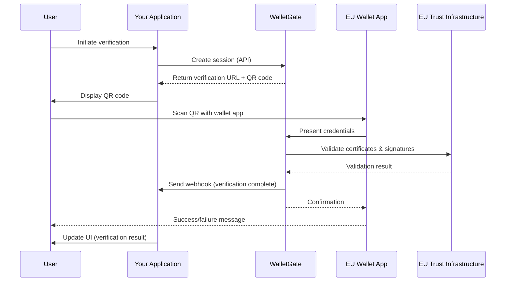

# Verification Flow

Understanding the complete verification flow from start to finish.

## Overview

The WalletGate verification flow consists of 6 main steps:

::: tip
In the diagram below, "Your Application" represents your website or app where users initiate verification.
:::



## Step-by-Step Flow

### Step 1: User Initiates Verification

User triggers verification on your platform (e.g., clicks "Verify Age" button).

**Your frontend:**
```typescript
// User clicks "Verify Age" button
const handleVerifyAge = async () => {
  setLoading(true);

  // Call your backend
  const response = await fetch('/api/verify/create', {
    method: 'POST',
    headers: { 'Content-Type': 'application/json' },
    body: JSON.stringify({
      userId: user.id,
      verificationType: 'age_over_18',
    }),
  });

  const { sessionId, qrCode } = await response.json();
  setQRCode(qrCode);
};
```

### Step 2: Your Backend Creates Session

Your backend calls WalletGate API to create a verification session.

**Your backend:**
```typescript
import { WalletGate } from '@walletgate/eudi';

app.post('/api/verify/create', async (req, res) => {
  const client = new WalletGate({
    apiKey: process.env.WALLETGATE_API_KEY,
  });

  const session = await client.createSession({
    checks: [
      { type: 'age_over', value: 18 },
    ],
    redirectUrl: `https://your-app.com/verify/success`,
    webhookUrl: `https://your-app.com/api/webhooks/walletgate`,
    metadata: {
      userId: req.body.userId,
      timestamp: Date.now(),
    },
  });

  res.json({
    sessionId: session.id,
    qrCode: session.qrCode,
    expiresAt: session.expiresAt,
  });
});
```

### Step 3: Display QR Code to User

Show the QR code in your UI for the user to scan.

**Your frontend:**
```typescript
import QRCode from 'react-qr-code';

function VerificationModal({ qrCodeData }) {
  return (
    <div className="modal">
      <h2>Scan with your EU Digital Identity Wallet</h2>

      <div className="qr-container">
        <QRCode value={qrCodeData} size={256} />
      </div>

      <p className="instructions">
        1. Open your EU Digital Identity Wallet app
        2. Tap "Scan QR Code"
        3. Point your camera at this code
      </p>

      <div className="supported-wallets">
        
        
        
      </div>
    </div>
  );
}
```

### Step 4: User Scans QR Code

User opens their EU Digital Identity Wallet and scans the QR code.

**What happens:**
1. Wallet app decodes QR code
2. Displays verification request details
3. Shows which attributes are requested (age, residency, etc.)
4. User reviews and approves/declines

**User's wallet shows:**
```
┌─────────────────────────────┐
│  Verification Request       │
├─────────────────────────────┤
│  From: YourApp.com          │
│                             │
│  Requesting:                │
│  ✓ Age verification (18+)   │
│  ✓ EU residency             │
│                             │
│  Your data:                 │
│  • Date of birth            │
│  • Country of residence     │
│                             │
│  [Approve]    [Decline]     │
└─────────────────────────────┘
```

### Step 5: WalletGate Validates Credentials

After user approves, WalletGate receives and validates the credentials.

**Validation process:**

1. **Receive VP Token**
   - Wallet sends Verifiable Presentation (VP)
   - Contains encrypted credentials

2. **Certificate Chain Validation**
   - Verify issuer certificate
   - Check certificate chain to trust anchor
   - Validate against EU LOTL

3. **Cryptographic Verification**
   - Verify digital signatures (RSA-PSS, ECDSA)
   - Check timestamp validity
   - Validate nonce/challenge

4. **Revocation Check**
   - Query OCSP endpoints
   - Check CRL lists
   - Verify credential not revoked

5. **Attribute Extraction**
   - Extract requested attributes
   - Verify attribute signatures
   - Check attribute validity periods

**WalletGate handles all of this automatically** - you just get the result!

### Step 6: Receive Verification Result

You receive the result via webhook (real-time) or polling.

#### Option A: Webhooks (Recommended)

**Your backend:**
```typescript
import crypto from 'crypto';

app.post('/api/webhooks/walletgate', (req, res) => {
  // 1. Verify webhook signature
  const signature = req.headers['wg-signature'];
  const timestamp = req.headers['wg-timestamp'];
  const payload = JSON.stringify(req.body);

  const expectedSignature = crypto
    .createHmac('sha256', process.env.WALLETGATE_WEBHOOK_SECRET)
    .update(`${timestamp}.${payload}`)
    .digest('hex');

  if (signature !== expectedSignature) {
    return res.status(401).send('Invalid signature');
  }

  // 2. Process webhook
  const { event, data } = req.body;

  if (event === 'verification.completed') {
    const { sessionId, status, results, metadata } = data;

    // Update your database
    await db.users.update({
      where: { id: metadata.userId },
      data: {
        ageVerified: results.age_over_18,
        verifiedAt: new Date(),
      },
    });

    // Notify user (WebSocket, push notification, etc.)
    io.to(metadata.userId).emit('verification:complete', {
      success: true,
      results,
    });
  }

  res.status(200).send('OK');
});
```

#### Option B: Polling

**Your frontend:**
```typescript
// Poll every 2 seconds
const pollSession = setInterval(async () => {
  const response = await fetch(`/api/verify/status/${sessionId}`);
  const session = await response.json();

  if (session.status === 'completed') {
    clearInterval(pollSession);
    setVerificationResult(session.results);
    setShowSuccessModal(true);
  } else if (session.status === 'failed' || session.status === 'expired') {
    clearInterval(pollSession);
    setError(session.error);
  }
}, 2000);

// Stop polling after 15 minutes
setTimeout(() => clearInterval(pollSession), 15 * 60 * 1000);
```

## Session States

| State | Description | Next Steps |
|-------|-------------|------------|
| `pending` | Session created, awaiting user scan | Display QR code |
| `in_progress` | User scanned, wallet is presenting credentials | Show loading state |
| `completed` | Verification successful | Process results, update UI |
| `failed` | Verification failed | Show error, offer retry |
| `expired` | 15-minute timeout reached | Create new session |
| `cancelled` | User declined in wallet | Offer to try again |

## Timing & Timeouts

- **Session expiry**: 15 minutes from creation
- **Recommended polling interval**: 2-3 seconds
- **Webhook retry**: 3 attempts with exponential backoff
- **Average completion time**: 10-30 seconds

## Security Considerations

### Your Responsibilities

✅ **Do:**
- Verify webhook signatures
- Use HTTPS for all API calls
- Store API keys securely (environment variables)
- Validate user sessions before creating verifications
- Log verification attempts for audit

❌ **Don't:**
- Expose API keys in frontend code
- Skip webhook signature verification
- Store raw credential data
- Allow unlimited verification attempts
- Trust client-side verification results

### WalletGate Handles

✅ **We handle:**
- Certificate chain validation
- Cryptographic signature verification
- Revocation checking
- Replay attack prevention
- Rate limiting
- PII minimization

## Error Handling

### Common Errors

**User Declines Verification**
```json
{
  "status": "cancelled",
  "error": {
    "code": "USER_DECLINED",
    "message": "User cancelled verification in wallet"
  }
}
```

**Expired Session**
```json
{
  "status": "expired",
  "error": {
    "code": "SESSION_EXPIRED",
    "message": "Verification session expired after 15 minutes"
  }
}
```

**Invalid Credentials**
```json
{
  "status": "failed",
  "error": {
    "code": "INVALID_CREDENTIALS",
    "message": "Certificate validation failed",
    "details": {
      "reason": "Certificate revoked by issuer"
    }
  }
}
```

[View complete error codes →](/api/error-codes)

## Best Practices

### 1. User Experience

```typescript
// ✅ Good: Show clear instructions
<div className="verification-flow">
  <h3>Verify Your Age</h3>
  <ol>
    <li>Open your EU Digital Identity Wallet</li>
    <li>Tap "Scan QR Code"</li>
    <li>Point camera at the code below</li>
    <li>Approve the request in your wallet</li>
  </ol>
  <QRCode value={verificationUrl} />
  <p className="supported-wallets">
    Works with all EU-certified wallets
  </p>
</div>
```

### 2. Mobile Deep Links

For mobile users, provide a direct link instead of QR code:

```typescript
const isMobile = /iPhone|iPad|Android/i.test(navigator.userAgent);

if (isMobile) {
  // Show button instead of QR code
  <a href={session.verificationUrl} className="btn-primary">
    Open in Wallet App
  </a>
} else {
  // Show QR code
  <QRCode value={session.verificationUrl} />
}
```

### 3. Progress Indicators

```typescript
const [stage, setStage] = useState('qr-display');

// Update based on session status
useEffect(() => {
  if (session.status === 'in_progress') setStage('processing');
  if (session.status === 'completed') setStage('success');
}, [session.status]);

return (
  <ProgressBar>
    <Step active={stage === 'qr-display'}>Scan QR Code</Step>
    <Step active={stage === 'processing'}>Verifying...</Step>
    <Step active={stage === 'success'}>Complete!</Step>
  </ProgressBar>
);
```

### 4. Retry Logic

```typescript
const handleRetry = async () => {
  // Create new session (old one may be expired)
  const newSession = await createVerificationSession();
  setSessionId(newSession.id);
  setQRCode(newSession.qrCode);
  setError(null);
};

if (session.status === 'failed' || session.status === 'expired') {
  <Button onClick={handleRetry}>Try Again</Button>
}
```

## Testing the Flow

### Test Mode

Use test API keys to simulate the entire flow:

```typescript
const client = new WalletGate({
  apiKey: 'wg_test_your_test_key',
});

// Creates a test session that auto-completes
const session = await client.createSession({
  checks: [{ type: 'age_over', value: 18 }],
});

// In test mode, session completes after ~5 seconds
// No real wallet needed!
```

### Live Mode Testing

For live testing, you'll need:
1. Test EU Digital Identity Wallet
2. Test credentials (from EU member state pilot programs)
3. Live API key

[Contact us](mailto:support@walletgate.app) for test wallet access.

## Next Steps

- 📖 [Set up Webhooks](/guide/webhooks)
- 🔒 [Learn about Authentication](/guide/authentication)
- ⚠️ [Handle Errors](/guide/error-handling)
- 📚 [Browse API Reference](/api/overview)
- 🎮 [Try Interactive API](/api/interactive)
