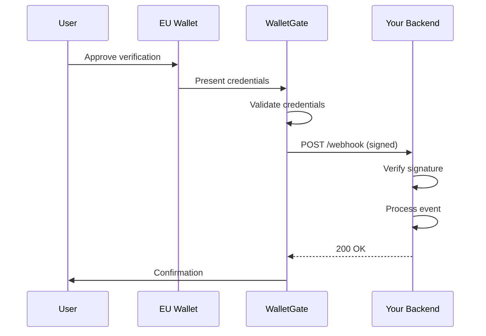

# Webhooks

Receive real-time notifications when verification events occur.

## Overview

Webhooks allow WalletGate to push verification results to your backend in real-time, eliminating the need for polling.

**Benefits:**
- ⚡ **Real-time updates** - Get notified within seconds
- 🔒 **Secure** - HMAC-SHA256 signed payloads
- 🔄 **Reliable** - Automatic retries with exponential backoff
- 📊 **Auditable** - Complete delivery logs in dashboard

## How Webhooks Work



## Setting Up Webhooks

### Step 1: Configure Webhook URL

When creating a verification session, include your webhook URL:

```typescript
import { WalletGate } from '@walletgate/eudi';

const client = new WalletGate({
  apiKey: process.env.WALLETGATE_API_KEY,
});

const session = await client.createSession({
  checks: [{ type: 'age_over', value: 18 }],
  webhookUrl: 'https://your-app.com/api/webhooks/walletgate',
  metadata: {
    userId: 'user_123',
    orderId: 'order_456',
  },
});
```

### Step 2: Create Webhook Endpoint

Create an endpoint to receive webhook events:

::: code-group

```typescript [Express]
import express from 'express';
import crypto from 'crypto';

const app = express();

// IMPORTANT: Use express.raw() for webhook endpoints
// We need the raw body to verify the signature
app.post(
  '/api/webhooks/walletgate',
  express.raw({ type: 'application/json' }),
  (req, res) => {
    // Verify signature (see next step)
    const isValid = verifyWebhookSignature(req);

    if (!isValid) {
      return res.status(401).send('Invalid signature');
    }

    // Parse body
    const event = JSON.parse(req.body.toString());

    // Process event
    handleWebhookEvent(event);

    // Return 200 quickly (process async if needed)
    res.status(200).send('OK');
  }
);
```

```typescript [Next.js API Route]
// pages/api/webhooks/walletgate.ts
import type { NextApiRequest, NextApiResponse } from 'next';
import crypto from 'crypto';

export const config = {
  api: {
    bodyParser: false, // We need raw body for signature verification
  },
};

export default async function handler(
  req: NextApiRequest,
  res: NextApiResponse
) {
  if (req.method !== 'POST') {
    return res.status(405).json({ error: 'Method not allowed' });
  }

  // Read raw body
  const buffer = await getRawBody(req);
  const rawBody = buffer.toString('utf8');

  // Verify signature
  const isValid = verifyWebhookSignature(req.headers, rawBody);

  if (!isValid) {
    return res.status(401).json({ error: 'Invalid signature' });
  }

  // Process event
  const event = JSON.parse(rawBody);
  await handleWebhookEvent(event);

  res.status(200).send('OK');
}
```

```python [Python/Flask]
from flask import Flask, request, jsonify
import hmac
import hashlib
import time

app = Flask(__name__)

@app.route('/api/webhooks/walletgate', methods=['POST'])
def walletgate_webhook():
    # Get headers
    signature = request.headers.get('wg-signature')
    timestamp = request.headers.get('wg-timestamp')

    # Get raw body
    raw_body = request.get_data()

    # Verify signature
    if not verify_signature(raw_body, signature, timestamp):
        return jsonify({'error': 'Invalid signature'}), 401

    # Parse event
    event = request.get_json()

    # Process event
    handle_webhook_event(event)

    return 'OK', 200

def verify_signature(raw_body, signature, timestamp):
    secret = os.getenv('WALLETGATE_WEBHOOK_SECRET')

    # Check timestamp freshness (5 minutes)
    age_ms = abs(time.time() * 1000 - int(timestamp))
    if age_ms > 5 * 60 * 1000:
        return False

    # Compute expected signature
    expected = hmac.new(
        secret.encode(),
        raw_body,
        hashlib.sha256
    ).digest().hex()

    return hmac.compare_digest(signature, expected)
```

:::

### Step 3: Verify Webhook Signature

**Always verify webhook signatures** to ensure requests come from WalletGate.

```typescript
import crypto from 'crypto';

function verifyWebhookSignature(
  headers: Record<string, string>,
  rawBody: string,
  maxAgeMs: number = 5 * 60 * 1000 // 5 minutes
): boolean {
  const timestamp = headers['wg-timestamp'];
  const signature = headers['wg-signature'];
  const webhookId = headers['wg-id'];

  if (!timestamp || !signature || !webhookId) {
    return false;
  }

  // Check timestamp freshness (prevents replay attacks)
  const age = Math.abs(Date.now() - parseInt(timestamp, 10));
  if (age > maxAgeMs) {
    console.warn('Webhook timestamp too old');
    return false;
  }

  // Compute expected signature
  const secret = process.env.WALLETGATE_WEBHOOK_SECRET;
  const expected = crypto
    .createHmac('sha256', secret)
    .update(rawBody)
    .digest('base64');

  // Timing-safe comparison
  try {
    return crypto.timingSafeEqual(
      Buffer.from(signature),
      Buffer.from(expected)
    );
  } catch (error) {
    return false;
  }
}
```

### Step 4: Process Webhook Events

Handle different event types:

```typescript
async function handleWebhookEvent(event: WebhookEvent) {
  const { event: eventType, sessionId, data, metadata } = event;

  switch (eventType) {
    case 'verification.completed':
      await handleVerificationCompleted(sessionId, data, metadata);
      break;

    case 'verification.failed':
      await handleVerificationFailed(sessionId, data, metadata);
      break;

    default:
      console.warn(`Unknown event type: ${eventType}`);
  }
}

async function handleVerificationCompleted(
  sessionId: string,
  results: any,
  metadata: any
) {
  // Update user in database
  await db.users.update({
    where: { id: metadata.userId },
    data: {
      ageVerified: results.age_over_18,
      residencyVerified: results.residency_eu,
      verifiedAt: new Date(),
    },
  });

  // Send notification to user
  await sendEmail(metadata.userId, {
    subject: 'Age Verification Complete',
    body: 'Your age has been successfully verified!',
  });

  // Trigger business logic
  if (results.age_over_18) {
    await grantAccessToRestrictedContent(metadata.userId);
  }

  console.log(`Verification completed for user ${metadata.userId}`);
}

async function handleVerificationFailed(
  sessionId: string,
  error: any,
  metadata: any
) {
  console.error(`Verification failed for session ${sessionId}:`, error);

  // Log failure
  await db.verificationAttempts.create({
    data: {
      userId: metadata.userId,
      sessionId,
      status: 'failed',
      error: error.message,
    },
  });

  // Notify user
  await sendEmail(metadata.userId, {
    subject: 'Verification Failed',
    body: `We couldn't verify your age. Reason: ${error.message}`,
  });
}
```

## Webhook Headers

Every webhook request includes these headers:

| Header | Description | Example |
|--------|-------------|---------|
| `wg-id` | Unique delivery ID | `wh_1a2b3c4d5e6f` |
| `wg-timestamp` | Unix timestamp (milliseconds) | `1704067200000` |
| `wg-signature` | HMAC-SHA256 signature (base64) | `abc123xyz789...` |

## Webhook Events

### verification.completed

Sent when a verification session completes successfully.

**Payload:**
```json
{
  "event": "verification.completed",
  "sessionId": "550e8400-e29b-41d4-a716-446655440000",
  "merchantId": "merchant_abc123",
  "data": {
    "age_over_18": true,
    "residency_eu": true,
    "identity_verified": true
  },
  "metadata": {
    "userId": "user_123",
    "orderId": "order_456"
  },
  "timestamp": "2024-12-31T12:00:00.000Z"
}
```

### verification.failed

Sent when a verification session fails.

**Payload:**
```json
{
  "event": "verification.failed",
  "sessionId": "550e8400-e29b-41d4-a716-446655440000",
  "merchantId": "merchant_abc123",
  "data": {
    "error": {
      "code": "INVALID_CREDENTIALS",
      "message": "Certificate validation failed",
      "details": {
        "reason": "Certificate revoked by issuer"
      }
    }
  },
  "metadata": {
    "userId": "user_123"
  },
  "timestamp": "2024-12-31T12:00:00.000Z"
}
```

## Delivery Guarantees

### Security Rules

WalletGate enforces strict delivery rules:

✅ **Allowed:**
- HTTPS only (TLS 1.2+)
- Public internet-accessible URLs
- Valid SSL certificates

❌ **Blocked:**
- HTTP (unencrypted)
- Private IP addresses (127.0.0.1, 10.0.0.0/8, 192.168.0.0/16)
- Localhost
- Internal networks

### Retry Policy

If your endpoint fails, WalletGate automatically retries:

1. **Immediate** - First attempt
2. **After 1 minute** - Second attempt
3. **After 5 minutes** - Third attempt (final)

**Considered failed if:**
- HTTP status is not 2xx
- Connection timeout (10 seconds)
- Network error

**Circuit breaker:**
After 10 consecutive failures, webhook delivery is paused for 1 hour.

### Timeouts

- **Request timeout**: 10 seconds
- **Connection timeout**: 5 seconds
- **Total max delivery time**: 15 minutes (including retries)

## Best Practices

### 1. Return 200 Quickly

Process webhooks asynchronously to avoid timeouts:

```typescript
app.post('/webhook', async (req, res) => {
  // Verify signature
  if (!verifySignature(req)) {
    return res.status(401).send('Invalid signature');
  }

  // Return 200 immediately
  res.status(200).send('OK');

  // Process async (don't await)
  processWebhookAsync(req.body).catch((error) => {
    console.error('Failed to process webhook:', error);
  });
});

async function processWebhookAsync(event: WebhookEvent) {
  // Heavy processing here
  await updateDatabase(event);
  await sendNotifications(event);
  await triggerWorkflows(event);
}
```

### 2. Implement Idempotency

Webhooks may be delivered multiple times. Handle duplicates:

```typescript
async function handleWebhookEvent(event: WebhookEvent) {
  const { sessionId } = event;

  // Check if already processed
  const existing = await db.webhookDeliveries.findUnique({
    where: { sessionId },
  });

  if (existing) {
    console.log(`Webhook already processed: ${sessionId}`);
    return; // Skip processing
  }

  // Mark as processing
  await db.webhookDeliveries.create({
    data: {
      sessionId,
      processedAt: new Date(),
      event: JSON.stringify(event),
    },
  });

  // Process event
  await processEvent(event);
}
```

### 3. Log All Deliveries

Keep audit logs for debugging:

```typescript
async function logWebhookDelivery(req: Request) {
  await db.webhookLogs.create({
    data: {
      deliveryId: req.headers['wg-id'],
      timestamp: req.headers['wg-timestamp'],
      event: req.body,
      signature: req.headers['wg-signature'],
      verified: true, // Only log if signature verified
      processedAt: new Date(),
    },
  });
}
```

### 4. Monitor Failures

Set up alerts for webhook failures:

```typescript
async function handleWebhookEvent(event: WebhookEvent) {
  try {
    await processEvent(event);
  } catch (error) {
    // Log error
    console.error('Webhook processing failed:', error);

    // Alert team (Slack, PagerDuty, etc.)
    await alertTeam({
      message: 'Webhook processing failed',
      sessionId: event.sessionId,
      error: error.message,
    });

    // Store for retry
    await db.failedWebhooks.create({
      data: {
        sessionId: event.sessionId,
        event: JSON.stringify(event),
        error: error.message,
        retryCount: 0,
      },
    });
  }
}
```

## Testing Webhooks

### Local Testing with ngrok

Expose your local server for testing:

```bash
# Install ngrok
brew install ngrok  # macOS
# or download from ngrok.com

# Start your local server
npm run dev  # Running on localhost:3000

# Expose with ngrok
ngrok http 3000
```

ngrok provides a public URL like `https://abc123.ngrok.io`

Use this URL in your test sessions:

```typescript
const session = await client.createSession({
  checks: [{ type: 'age_over', value: 18 }],
  webhookUrl: 'https://abc123.ngrok.io/api/webhooks/walletgate',
});
```

### Test Mode

Test webhooks fire automatically in test mode:

```typescript
const client = new WalletGate({
  apiKey: 'wg_test_your_test_key',
});

const session = await client.createSession({
  checks: [{ type: 'age_over', value: 18 }],
  webhookUrl: 'https://your-app.com/webhooks',
});

// In test mode, webhook fires after ~5 seconds
// with mock verification data
```

### Manual Testing

Simulate webhook delivery from dashboard:

1. Go to [walletgate.app/admin)
2. Click **"Test Webhook"**
3. Select event type
4. Enter your webhook URL
5. Click **"Send Test Event"**

## Debugging

### Common Issues

**1. Signature Verification Fails**

```typescript
// ❌ Wrong: Parsing body before verification
app.use(express.json());  // This parses the body!
app.post('/webhook', (req, res) => {
  verifySignature(req.body); // Wrong - body is parsed object
});

// ✅ Correct: Use raw body
app.post('/webhook',
  express.raw({ type: 'application/json' }),
  (req, res) => {
    const rawBody = req.body.toString();
    verifySignature(rawBody); // Correct - raw string
  }
);
```

**2. Timeout Errors**

```typescript
// ❌ Wrong: Slow synchronous processing
app.post('/webhook', async (req, res) => {
  await heavyProcessing(); // Takes 30 seconds
  res.send('OK'); // Too late - already timed out!
});

// ✅ Correct: Return 200 immediately
app.post('/webhook', async (req, res) => {
  res.send('OK'); // Return immediately
  heavyProcessing().catch(console.error); // Process async
});
```

**3. Private IP Blocked**

```
Error: Webhook URL uses private IP address
```

**Fix:** Use public URL or ngrok for local testing

### Viewing Delivery Logs

Check webhook delivery status in the dashboard:

1. Go to `/admin/webhooks`
2. Use **Webhook Inspector** to:
   - View delivery status, response codes, and errors
   - Inspect payload and signature
   - Retry failed deliveries

## Security

### Signature Verification

**Always verify signatures** to prevent:
- Forged requests
- Replay attacks
- Man-in-the-middle attacks

```typescript
// ✅ Good: Always verify
if (!verifySignature(req)) {
  return res.status(401).send('Invalid signature');
}

// ❌ Bad: Never skip verification
// if (process.env.NODE_ENV === 'development') {
//   // Skip verification - DANGEROUS!
// }
```

### Timestamp Validation

Reject old webhooks to prevent replay attacks:

```typescript
const MAX_AGE_MS = 5 * 60 * 1000; // 5 minutes

const timestamp = parseInt(req.headers['wg-timestamp'], 10);
const age = Math.abs(Date.now() - timestamp);

if (age > MAX_AGE_MS) {
  return res.status(400).send('Webhook too old');
}
```

### HTTPS Only

WalletGate only delivers to HTTPS endpoints.

**Requirements:**
- Valid SSL certificate
- TLS 1.2 or higher
- No self-signed certificates

## Rate Limits

Webhook delivery is not rate-limited, but your endpoint should:

- ✅ Handle bursts (100+ webhooks/second)
- ✅ Return 200 within 10 seconds
- ✅ Queue heavy processing

## Next Steps

- 🔄 [Verification Flow](/guide/verification-flow)
- 🔐 [Authentication](/guide/authentication)
- ⚠️ [Error Handling](/guide/error-handling)
- 📚 [API Reference](/api/overview)

## Need Help?

- 📧 Email: [support@walletgate.app](mailto:support@walletgate.app)
- 📖 [FAQ](https://walletgate.app#faq)
- 💬 [Book a demo](mailto:hello@walletgate.app)
